# Altimeter processing baseline

## version 4.0

### Retracking
Some missions were retracked specifically for the CCI Sea State dataset, 
using WHALES retracker, whereas in some cases the data retracked by other 
agencies were used instead. 

{numref}`swh_retrackers` summarized the retracker used for each 
mission for significant wave height, whether the retracking was performed by 
CCI Sea State production team (WHALES) or a third party agency:

```{table} Retracker used for each mission for retrieving the significant wave height
:name: swh_retrackers

| source                   | period             | retracker     | 
|--------------------------|--------------------|---------------|
| ERS-1                    | 07/1991 to 03/2000 | REAPER (MLE3) | 
| ERS-2                    | 04/1995 to 07/2011 | REAPER (MLE3) | 
| Jason-1 Version E        | 01/2002 to 07/2013 | WHALES        | 
| Jason-2 Version D        | 06/2008 to 10/2019 | WHALES        | 
| Jason-3 Version D        | 09/2016 to 06/2019 | WHALES        | 
| Jason-3 Version F        | 06/2019 to now     | WHALES        | 
| Jason-3 Version T        | 02/2016 to 09/2016 | WHALES        | 
| Topex Version F          | 08/1992 to 01/2006 | MLE3          |
| Envisat Version 3        | 03/2002 to 04/2012 | WHALES        | 
| CryoSat-2  Version D     | 07/2010 to 12/2020 | WHALES        |  
| CryoSat-2  Version E     | 01/2021 to now     | WHALES        | 
| SARAL Version T          | 02/2013 to now     | WHALES        |
| Sentinel-6 A Version F08 | 03/2020 to 12/2023 |               |   
| Sentinel-6 A Version F09 | 12/2023 to now     |               | 
| Sentinel-3 A Version 005 | 02/2016 to now     |               |
| Sentinel-3 B Version 005 | 04/2018 to now     |               |
```


### Compression to 1 Hz

This section summarizes how the full resolution  (20/40 Hz) measurements are 
edited and compressed into 1 Hz measurements. The same full resolution to 1 Hz 
measurement mapping is used as in agency (S)GDR products so that a CCI Sea 
State 1 Hz file is fully comparable to the corresponding GDR file. 

#### Land detection
- full resolution (20/40 Hz) SWH and sigma0 values are flagged as land when 
  their distance to coast is **greater than 1000m**, based on the Goddard Space 
  Flight Center 1km resolution grid of distance to coast. They are ignored 
  in the compression process.

#### Significant wave height (SWH)

- SWH for uncompressed (20/40 Hz) measurements are discarded if not in the 
  range: [-0.5, 30]
- when available, the full resolution quality flag is also used to discard 
  invalid full resolution measurements, as summarized in {numref}`fullres_swh`

```{table} selected variable for SWH in each full resolution dataset, and the corresponding quality flag variable used to discard invalid measurements
:name: fullres_swh

| Source                  | SWH                    | SWH quality                         |
|-------------------------|------------------------|-------------------------------------|
| Jason-1 Version E       | swh.07                 | swh_WHALES_fitting_error_20hz > 0.3 |
| Jason-2 Version D       | swh.07                 | swh_WHALES_fitting_error_20hz > 0.3 |
| Jason-3 Version D       | swh_WHALES_20hz        | swh_WHALES_fitting_error_20hz > 0.3 |
| Jason-3 Version F       | swh_WHALES_20hz        | swh_WHALES_qual_20hz == 0           |
| Jason-3 Version T       | swh_WHALES_20hz        | swh_WHALES_fitting_error_20hz > 0.3 |
| Topex Version F         | swh_20hz_ku            | swh_used_20hz_ku == 0               |
| Envisat Version 3       | swh_WHALES_20hz        | swh_WHALES_qual_20hz == 0           |
| ERS-1 REAPER            | swh_20hz               | swh_used_20hz == 0                  |
| ERS-2 REAPER            | swh_20hz               | swh_used_20hz == 0                  |
| CryoSat-2 Version D     | swh_WHALES_20hz        | swh_WHALES_fitting_error_20hz > 0.3 |
| CryoSat-2 Version E     | swh_WHALES_20hz        | swh_WHALES_fitting_error_20hz > 0.3 |
| Saral Version T         |                        |                                     |
| Sentinel-6A Version F08 | swh_ocean              | swh_ocean_qual == 1                 |
| Sentinel-6A Version F09 | swh_ocean              | swh_ocean_qual ==1                  |
| Sentinel-3A Version 005 | swh_ocean_20_plrm_ku   | swh_ocean_qual_20_plrm_ku == 0      |
| Sentinel-3B Version 005 | swh_ocean_20_plrm_ku   | swh_ocean_qual_20_plrm_ku == 0      |
```

- uncompressed (20/40 Hz) measurement outliers are discarded using the maximum
  absolute deviation for 3-sigma criterion (MAD) scheme
- the median of the remaining measurements is selected as 1 Hz value 
- when there were less than 6 (12 for SARAL) valid remaining measurements, the 
  1 Hz value is flagged as **bad** in the `quality_level` variable. 
- for some retrackers, a correction is applied to the uncompressed (20/40 Hz) 
  measurements, into a `swh_corrected` variable. The same scheme is applied to
  these corrected measurements to provide a 1 Hz corrected SWH value. The 
  corrected missions are listed in {numref}`fullres_swh_correction`. The 
  corrections were estimated by G.Quartly for version 2 CCI dataset (provided
  on 29-Apr-2021)
  
```{table} missions for which a correction is applied to full resolution SWH measurements
:name: fullres_swh_correction

| Source                  | Correction of SWH      |
|-------------------------|------------------------|
| Jason-1 Version E       | Yes                 |
| Jason-2 Version D       | Yes                 |
| Jason-3 Version D       | Yes        |
| Jason-3 Version F       | Yes        |
| Jason-3 Version T       | Yes        |
| Topex Version F         |             |
| Envisat Version 3       | Yes        |
| ERS-1 REAPER            |                |
| ERS-2 REAPER            |                |
| CryoSat-2 Version C     | Yes                       |
| CryoSat-2 Version C     | Yes                       |
| CryoSat-2 Version E     | Yes                       |
| Saral Version T         | Yes                       |
| Sentinel-6A Version F08 |               |
| Sentinel-6A Version F09 |               |
| Sentinel-3A Version 005 |  |
| Sentinel-3B Version 005 |    |
```


#### Sigma0
- sigma0 are **always taken from third party (agency) SGDR**, in C and Ku band 
  (Ka for SARAL) - using MLE3 Ku band sigma0 when available, as summarized in 
  {numref}`fullres_sigma0`
- when available, the full resolution quality flag is also used to discard 
  invalid full resolution measurements, as summarized in {numref}`fullres_sigma0`

```{table} selected variable for sigma0 in each full resolution dataset, for each sensing band, and the corresponding quality flag variable used to discard invalid measurements
:name: fullres_sigma0
| Source                   | Sigma0                | Sigma0 quality                           |
|--------------------------|-----------------------|------------------------------------------|
| Jason-1 Version E        | sig0_20hz_ku          | sig0_used_20hz_ku == 0                   |
|                          | sig0_20hz_c           | sig0_used_20hz_c == 0                    |
| Jason-2 Version D        | sig0_20hz_ku_mle3     | sig0_used_20hz_ku_mle3 == 0              |
|                          | sig0_20hz_c           | sig0_used_20hz_c == 0                    |
| Jason-3 Version D        | sig0_20hz_ku_mle3     | sig0_used_20hz_ku_mle3 == 0              |
|                          | sig0_20hz_c           | sig0_used_20hz_c == 0                    |
| Jason-3 Version F        | ku_sig0_ocean_mle3    | ku_sig0_ocean_mle3_compression_qual == 0 |
|                          | c_sig0_ocean          | c_sig0_ocean_compression_qual == 0       |
| Jason-3 Version T        |                       |                                          |
| Topex Version F          | sig0_20hz_ku_mle3     | sig0_used_20hz_ku == 0                   |
| Envisat Version 3        | sig0_ocean_20_ku      | sig0_ocean_qual_20_ku == 0               |
| ERS-1 REAPER             | ocean_sig0_20hz       | ocean_sig0_used_20hz                     |
| ERS-2 REAPER             | ocean_sig0_20hz       | ocean_sig0_used_20hz                     |
| CryoSat-2  Version D     | sig0_1_20_ku          |                                          |
| CryoSat-2  Version E     | sig0_1_20_ku          |                                          |
| SARAL Version T          | sig0_40hz             | sig0_used_40hz == 0                      |
| Sentinel-6 A Version F08 | ku_sig0_ocean_mle3    | c_sig0_ocean_qual != 1                   |
|                          | c_sig0_ocean          | ku_sig0_ocean_mle3_qual != 1             |
| Sentinel-6 A Version F09 | ku_sig0_ocean_mle3    | c_sig0_ocean_qual != 1                   |
|                          | c_sig0_ocean          | ku_sig0_ocean_mle3_qual != 1             |
| Sentinel-3 A Version 005 | sig0_ocean_20_plrm_ku | sig0_ocean_qual_20_plrm_ku == 0          |
|                          | sig0_ocean_20_c       | sig0_ocean_qual_20_c == 0                |
| Sentinel-3 B Version 005 | sig0_ocean_20_plrm_ku |                                          |
|                          | sig0_ocean_20_c       |                                          |
```

> **S-band sigma0** were discarded for **Envisat** as it was found they were 
> systematically flagged as bad in the SGDR product.


- sigma0 for uncompressed (20/40 Hz) measurements are discarded if not in the 
  range: [7, 30] (except for SARAL Ka sigma0: [-6.5, 23.])
- uncompressed (20/40 Hz) measurement outliers are discarded using the maximum
  absolute deviation for 3-sigma criterion (MAD) scheme
- the median of the remaining measurements is selected as 1 Hz value 
- when there were less than 6 (12 for SARAL) valid remaining measurements, the 
  1 Hz value is flagged as **bad** in the `quality_level` variable.
  

### L2P Processing

The base 1 Hz compressed files are enriched with additional variables and 
consolidated into L2P products.

#### SWH quality level

The quality level of SWH measurement, provided in the `quality_level` variable 
is estimated by applying a suite of specific tests. When positive, a test will 
downgrade a SWH measurement (starting initially with the quality level inherited
from the 1 Hz compressed data file) to a lower value, as given in the following 
table. The result of each applied test is summarized in the corresponding 
`rejection_flags` variable.

```{table} Quality level assigned to a validity test if positive (with corresponding label in the rejection_flags variable
:name: swh_quality_level

| Validity test | Assigned quality level  |
| `sea_ice`: 0 < sea ice concentration <= 10% | 2 |
| `sea_ice`: sea ice concentration > 10% | 1 |
| `swh_validity`: 0 <= SWH <= 30 | 1 |
| `swh_rms_outlier`: SWH RMS in 1 Hz meaurement > LUT value | 1 |
| `outlier_test`: SWH outlier test | 1 |
```

#### Ancillary atmospheric model variables

```{table} ERA5 atmospheric model variables added to each 1 Hz measurement in L2P
:name: ancillary_era5

| Variable | Description                     |
|----------|---------------------------------|
| tclw     | Total column cloud liquid water |
| t2m      | 2 metre temperature             |
| sst      | Sea surface temperature         |
| u10      | 10 metre U wind component       |
| v10      | 10 metre V wind component       |
| sp       | Surface pressure                |
```

#### Ancillary wave model variables

```{table} ERA5/WAM wave model variables added to each 1 Hz measurement in L2P
:name: ancillary_era5wam

| Variable   | Description                                         |
|------------|-----------------------------------------------------|
| swh        | Significant height of combined wind waves and swell |
| pp1d       | Peak wave period                                    |
| p1ps       | Mean wave period based on first moment of swell     |
| p140121    | Significant wave height of first swell partition    |
| p140122    | Mean wave direction of first swell partition        |
| mwp        | Mean wave period                                    |
| mwd        | Mean wave direction                                 |
| shww       | Significant height of wind waves                    |
| mdww       | Mean direction of wind waves                        |
| mpww       | Mean period of wind waves                           |
```

```{table} Ifremer/WW3 hindcast wave model variables added to each 1 Hz measurement in L2P
:name: ancillary_ifrww3

| Variable   | Description                                |
|------------|--------------------------------------------|
| uwnd       | 10 metre U wind component                  |
| vwnd       | 10 metre V wind component                  |
| hs         | Significant height of wind and swell waves |
| t02        | Mean period T02                            |
| t0m1       | Mean period T0m1                           |
| 1/fp       | Wave peak frequency                        |
| dir        | Wave mean direction                        |
| skw        | skewness                                   | 
| qkk        | k-peakedness                               |
```

```{note}
The WW3 model configuration ran for this ancillary source uses surface currents 
(from CMEMS) and icebergs computed from altimetry and only available from 1993.
The configuration used for the years 1991-1992 is therefore different and not
full consistent with the model configuration used from 1993 onward. 
```

#### Ancillary sea ice concentration

Different sources are combined for sea ice concentration, as the best 
resolution datasets (25 km) do not cover the full CCI Sea State temporal 
coverage.

```{table} sources for sea ice concentration (SIC) CDR, by order of priority
:name: ancillary_sic

|                      | Variable | Temporal Coverage     | Description                                                                                                                                                 |
|----------------------|----------|-----------------------|-------------------------------------------------------------------------------------------------------------------------------------------------------------|
| OSISAF-AMSR-CDR-v3p0 | ice_conc | 2002-2020 (ext: 2024) | AMSR Sea Ice Concentration Climate Data Record from OSI SAF (doi: 10.15770/EUM_SAF_OSI_0015)                                                                |
| SICCI-HR-SIC         | ice_conc | 1991-2020             | High(er) Resolution Sea Ice Concentration Climate Data Record Version 3 from CCI Sea Ice+ (SSM/I and SSMIS) (doi: 10.5285/eade27004395466aaa006135e1b2ad1a) |
```

### Verifications

Production of the Sea State CCI dataset involved a number of processing steps that need to be verified before generating and delivering the final dataset to the Validation and Climate Assessment teams.

#### LUT RMS

The verification steps will be applied to each mission on 8 cycles. The number of cycles is a trade-off between CPU time and statistical robustness of the proposed diagnostics. 
For some processing steps, it is expected that a larger number of cycles will have to be processed (e.g. EMD filtering or cross calibration). In that case, the selected period will be indicated below for the corresponding step.  
The selected cycles correspond to periods of nominal orbit and nominal functioning of the instruments:

| Mission     | Cycles                          |
|-------------|---------------------------------|
| ERS-1       | 154/92/84/146/148/149/151/98    |
| ERS-2       | 50/82/43/63/45/76/46/36         |
| TOPEX-A1    | 108/112/122/16/22/25/67/73      |
| TOPEX-A2    | 134/143/148/158/198/208/218/221 |
| TOPEX-B     | 246/254/306/328/364/428/444/453 |
| JASON-1E    | 184/79/191/339/96/510/512/253   |
| JASON-2D    | 206/319/179/286/146/3/48/195    |
| JASON-3D    | 74/74/11/46/88/14/26/63         |
| JASON-3F    | 319/325/194/196/348/349/356/357 |
| ENVISAT-V3  | 105/54/77/84/87/89/96/9         |
| SARAL       | 105/21/13/22/100/112/6/103      |
| SENTINEL-3A | 10/27/34/37/49/59/62/65         |
| SENTINEL-3B | 11/21/25/27/31/47/48/51         |
| SENTINEL-6A | 11/12/17/21/25/27/31/47         |

Below, the average LUTs for each mission :

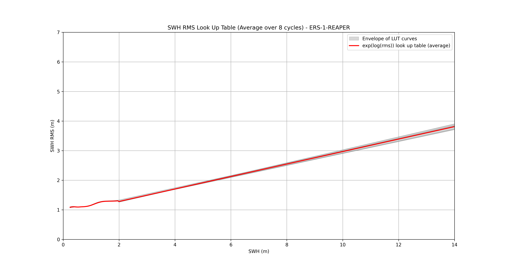
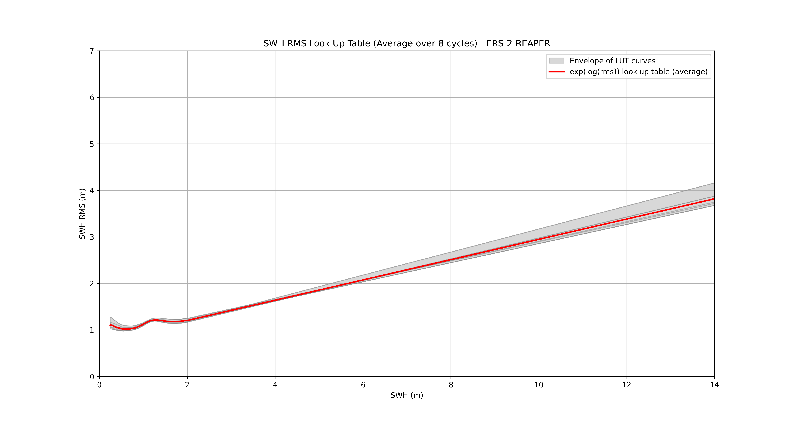
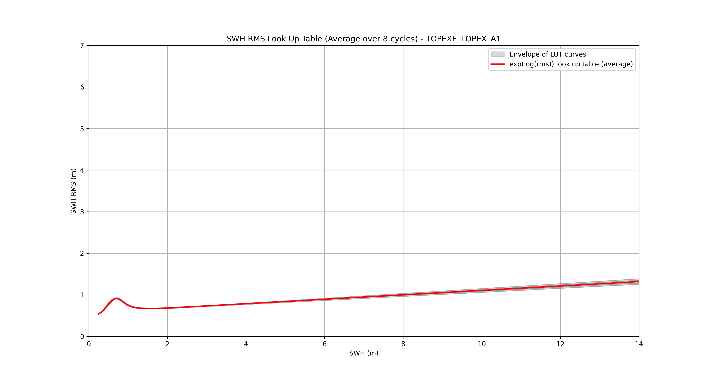
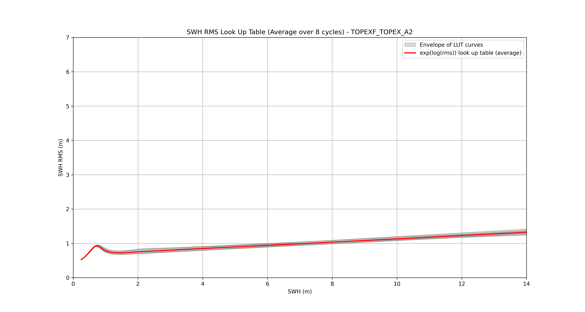
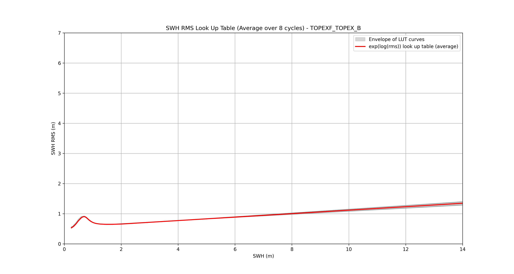
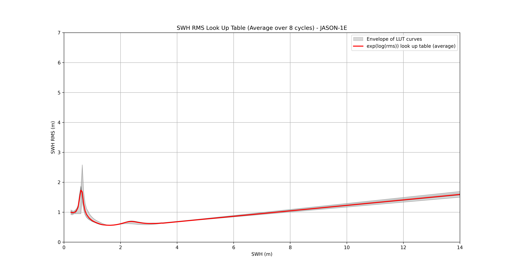
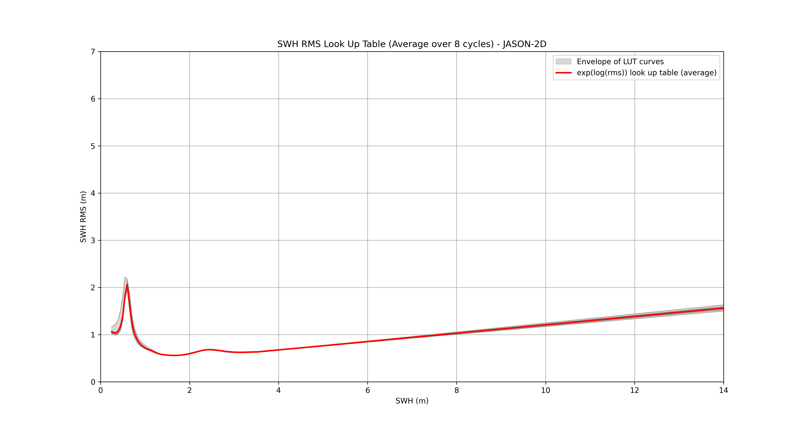
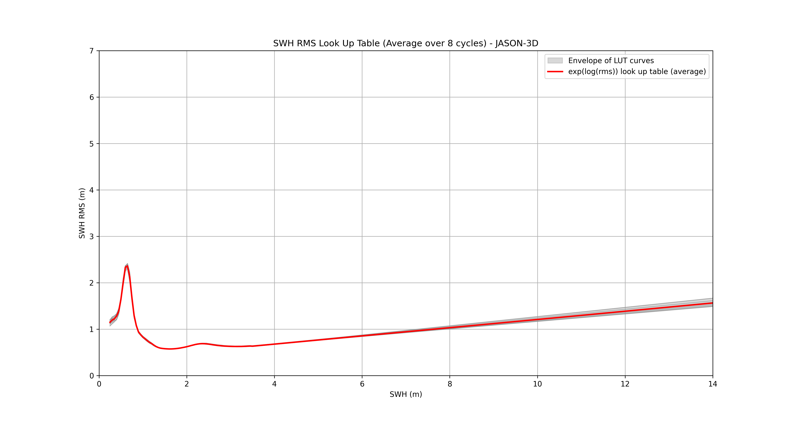
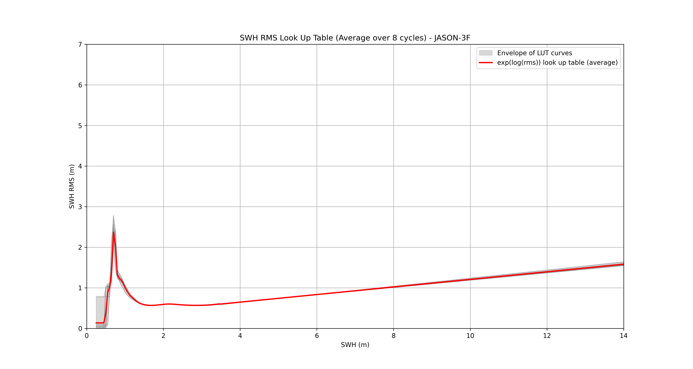
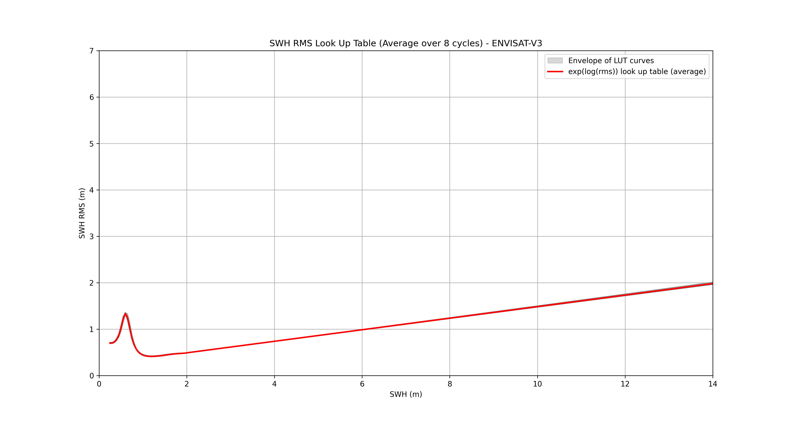
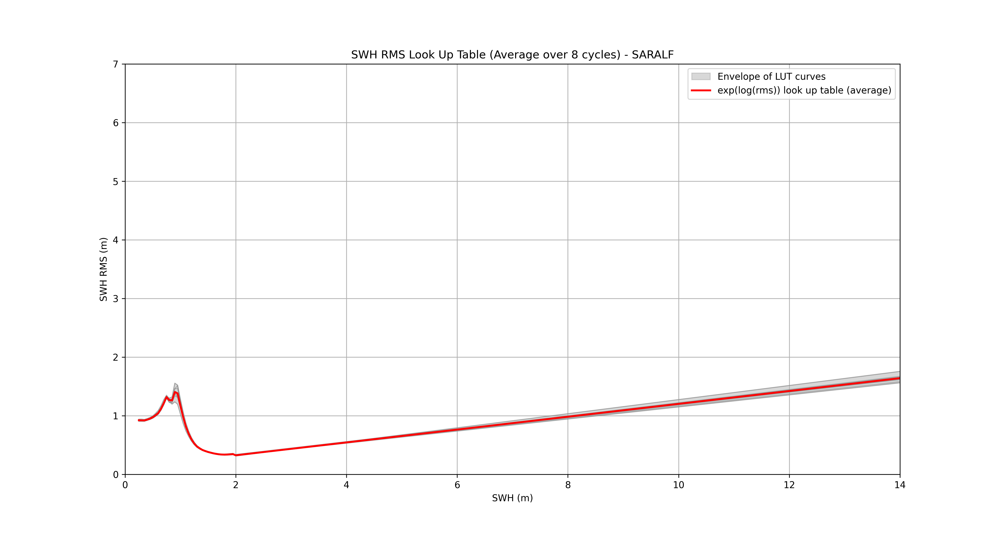
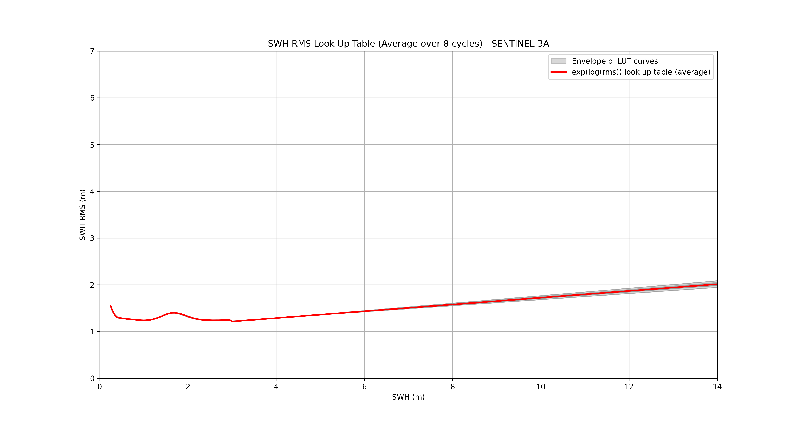
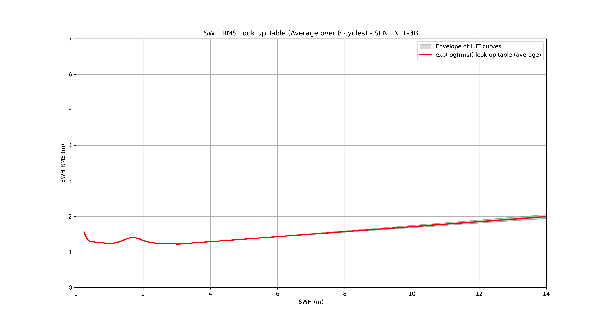
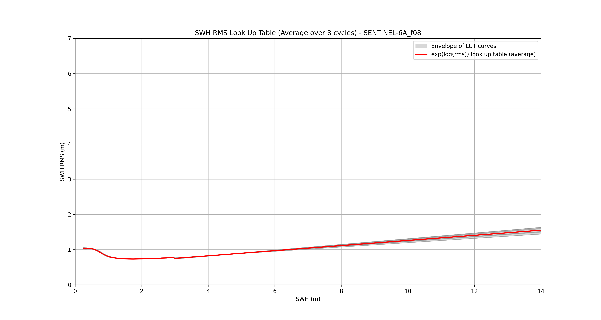

