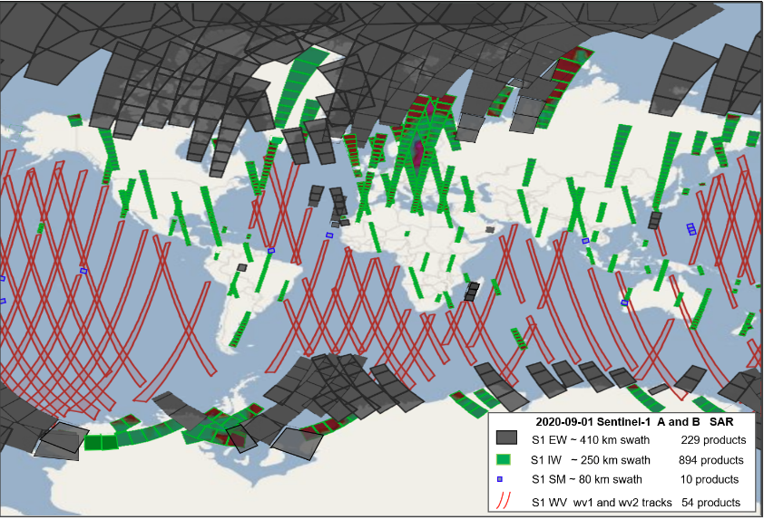

# SAR-SeaStaR

## EO data processed by SAR-SeaStaR (DLR)

- S1- Interferometric Wide Swath Mode (**IW**) GRD (Ground Range Detected) L1 
  products
- S1- Extra Wide (**EW**) GRD L1 products.
- S1- wave mode (**WV**) SAR Single Look Complex (SLC) L1 products.

The VV or HH polarization data were used, with priority to VV products for S1 IW and S1 EW.

```{table} GRD S1 IW, S1 EW and S1 WV SLC products common information
:name: dlr_products

| Name        | ca. coverage | pixel spacing | GB per SAR L1 original ID product | N worldwide/ocean scenes per day (S1A+S1B in 2020)|
|-------------| ------------ | ------------- | --------------------------------- | --------------------------------------------------|
| S1 IW / GRD | 250×200 km   | 10 m          | ca. 3 GB                          | ca.    900 / 500                                  |
| S1 EW / GRD | 400×350 km   | 40 m          | ca. 0.6 GB                        | ca.    260 / 200                                  |
| S1 WV / SLC | 20×20 km     | ca. 3.5 m     | ca. 5 GB                          | ca. 50 ID-products each with ca. 80–120 imagettes |    
|             | each 100 km  |               | (min – ca. 2 GB max.- 16 GB)      |                                                   |
|             | along-track  |               |                                   |                                                   |
|             | imagettes    |               |                                   |                                                   |
 ```

 ```


:name: An example of S1 worldwide acquisitions on 2020-09-01. There are 54 S1 WV tracks (red), 894 S1 IW images (green), 229 S1 EW images (grey).

```

**Ancillary data (Land masks)**
- SRTM - Shuttle Radar Topography Mission (SRTM) -60°<LAT<60°.
- GSHHG - Global Self-consistent, Hierarchical, High-resolution Geography 
  Database.

**Model data (training/validations)**
- Météo-France WAve Model (MFWAM) with a spatial resolution of 1/5° degrees. 
  Global Ocean Waves Reanalysis (https://data.marine.copernicus.eu/product/GLOBAL_MULTIYEAR_WAV_001_032/description) 
  past sea states since years 1980. 
- WaveWatch-3 (WW3) model of National Oceanic and Atmospheric Administration 
  (NOAA, https://polar.ncep.noaa.gov/waves/(https://polar.ncep.noaa.gov/waves/)) 
  with a spatial resolution of 1/2 degrees (spatially interpolated for 
  collocation) for collocations before 2016. 


## DLR Algorithm SAR-SeaStaR  

The empirical algorithm SAR-SeaStaR (SAR Sea State Retrieval) is developed 
at German Aerospace Center DLR, Maritime Safety and Security Lab Bremen. 
From SAR data, SAR-SeaStaR estimates a series of integrated sea state 
parameters: total significant wave height SWH, wave heights of dominant and 
secondary swells and windsea, mean, first and second moment wave periods, 
and windsea period. SAR scenes are processed in raster format, the output 
are fields for each parameter showing their spatial distribution.

SAR-SeaStaR is adopted for different satellites Sentinel-1 (S1) and 
TerraSAR-X (TS-X) and modes (state-of-the-art 2024): 
− S1 Wave Mode (WV) Level-1 (L1) products 
− S1 Interferometric Wide Swath Mode (IW)
− S1 Extra Wide (EW) 
− TerraSAR-X (TS-X) StripMap (SM)

SAR-SeaStaR is based on combination of the linear regression function 
CWAVE_EX (Pleskachevsky et al., 2022) and a machine learning approach using the
support vector machine (SVM) technique. 

```{figure} ../images/dlr_sar_fig2.png
:name: dlr_sar_outputs

DLR SAR-SeaStaR outputs. Example of eight sea state parameter grids 
retrieved from a S1 IW scene with ca. 1600 km × 200 km coverage acquired 
during a strong storm in the North Atlantic on 2020-02-14 at 18:45 UTC with 
SWH reaching ca. 13 m. Processing in a 5 km raster results in ca. 1500 
subscenes (approximately ~30×50) for each individual IW image. Isolines shows 
the results of forecast WFWAM at 18:00 UTC (excluding first moment not provided 
by Copernicus Marine Environment CMEMS).
```

```{figure} ../images/dlr_sar_fig3.png
:name: dlr_sar_example

Example of Sentinel-1 WV archive processing. In the right half of the figure 
only one-day of acquisitions is displayed on the globe, on the left half all 
data acquired during February 2021 is displayed.
```

The SAR-SeaStaR algorithm includes the complete processing chain with a series
of steps needed to reach high accuracy: 
1. Filtering of the image artefacts (e.g. ships, wakes, offshore windfarms 
   constructions, etc.).
2. Resampling and denoising (e.g. for S1 IW resampling from 10 m to 2.5 m 
   pixel spacing).
3. SAR features estimation and control-of-features.
4. Model functions (linear regression and machine learning models) for 
   estimation of sea state parameters.
5. Control-of-results using filtering procedures. 

The SAR-SeaStaR estimation of sea state parameters is based on an analysis 
of the normalized radar cross-section (NRCS) of a subscene. A series of 
subscenes are initialized in a raster format and their analysis results in a 
continuous grid for series of integrated sea state parameters. The grid’s 
raster step is the distance between the centre points of analysed subscenes. 
One of the basic variables represents the SAR image spectrum obtained using 
fast Fourier transformation (FFT) applied to radiometrically calibrated, 
filtered, denoised, land-masked and normalised subscenes with a size of 
1024×1024 pixels in wave number domain. 

**Linear regression**. The empirical linear regression CWAVE_EX (extended 
CWAVE) model function uses primary SAR features estimated directly from the 
subscenes and secondary features. Secondary features are combinations of 
primary features in quadratic and inverse form. In total, 54 primary and the 
77 most significant secondary features are applied in CWAVE_EX. 
Normalization of features using mean (MEAN) and standard deviation (STD) for 
each feature was found to be optimal. The primary features are of five 
different types:
1. NRCS and NRCS statistics (variance, skewness, kurtosis, etc.), in total 9 
   features. 
2. Geophysical parameters (surface wind speed estimated from analysed 
   subscene using CMOD‑5N algorithms for C-band and XMOD‑2 for X-Band), 1 feature.
3. Grey Level Co-occurrence Matrix (GLCM) parameters (homogeneity, 
   dissimilarity, etc.), in total 8 features.
4. Spectral parameters based on image spectrum integration for different 
   wavelength domains (0-30 m, 30-100 m, 100-400 m, etc.) and spectral width 
   parameters (Longuet-Higgins, Goda), in total 17 features.
5. Spectral parameters using products of normalized image spectrum with 
   orthonormal functions (CWAVE approach) and cutoff wavelength estimated 
   using autocorrelation function (ACF), in total 21 features.

Note, sea state is estimated form prefiltered subscenes, where the NRCS of 
outliers (ships, wakes, oil, etc.) and noise are essentially removed. 

**Machine learning**. The SVM technique was applied to SAR-SeaStaR with nu-SVR 
Support Vector Regression (ν-SVR) with a radial basis function as kernel 
type. For practical applications, the high-performance ThunderSVM (TSVM) 
library was applied. TSVM runs an order of magnitude faster than the 
standard LibSVM and allows training of large datasets. The input for the SVM 
are the primary features complemented with: 
- first-guess Hs from CWAVE_EX linear regression solution.
- precise incidence angle with an accuracy of third decimal place.
- flag identifying the satellite (S1-A or S1-B for Sentinel-1). 
- pixel spacing (different for e.g. EW GRDH (25 m pixel) and GRDM (40 m pixel)
  products)
- flag identifying polarisation (HH or VV).

```{admonition} References
:class: note

Pleskachevsky, A., Tings, B., Jacobsen, S., Wiehle, S., Schwarz, E., and D. 
Krause, 2024: A System for Near Real Time Monitoring of the Sea State using 
SAR Satellites. IEEE Transactions on Geoscience and Remote Sensing, VOL. 62, 2024

Pleskachevsky, A., Tings, B., and S, Jacobsen, 2022: Multiparametric Sea 
State Fields from Synthetic Aperture Radar for Maritime Situational 
Awareness, RSE, vol. 280, 22 pp.

Pleskachevsky, A., Jacobsen, S., Tings, B., and E. Schwarz, 2019. Estimation 
of sea state from Sentinel-1 Synthetic aperture radar imagery for maritime 
situation awareness. IJRS, Vol. 40-11, pp. 4104-4142.

Pleskachevsky, A., W. Rosenthal, and S. Lehner, 2016:  Meteo-Marine 
Parameters for Highly Variable Environment in Coastal Regions from Satellite 
Radar Images.” JPRS, Vol. 119, pp. 464-484., 2016.
```

