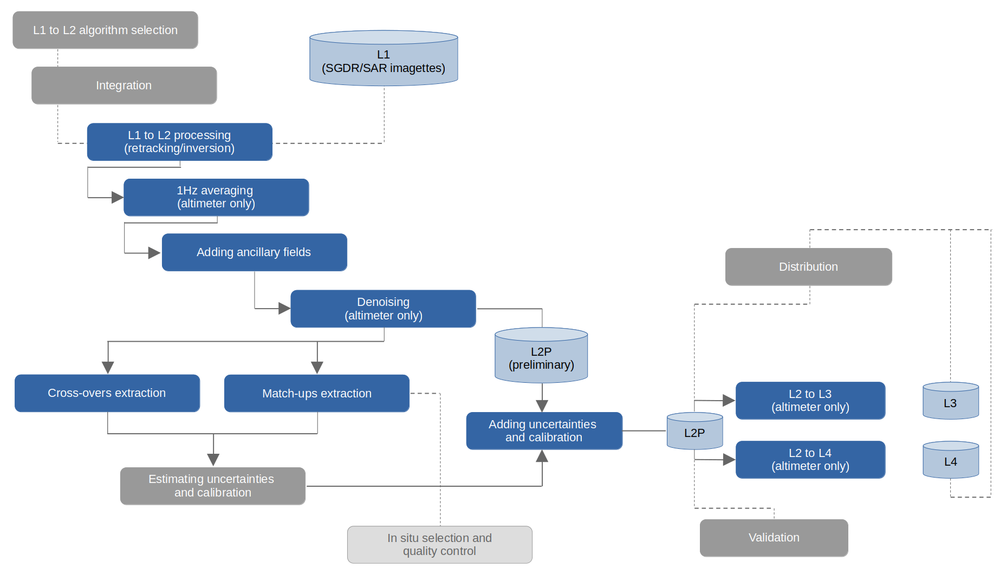
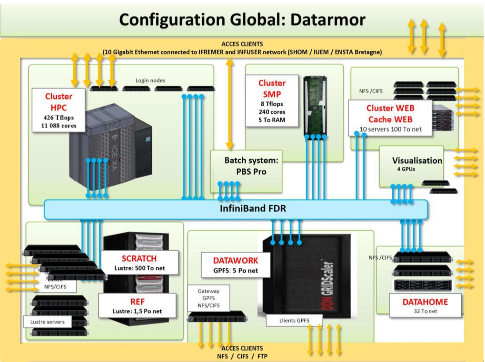
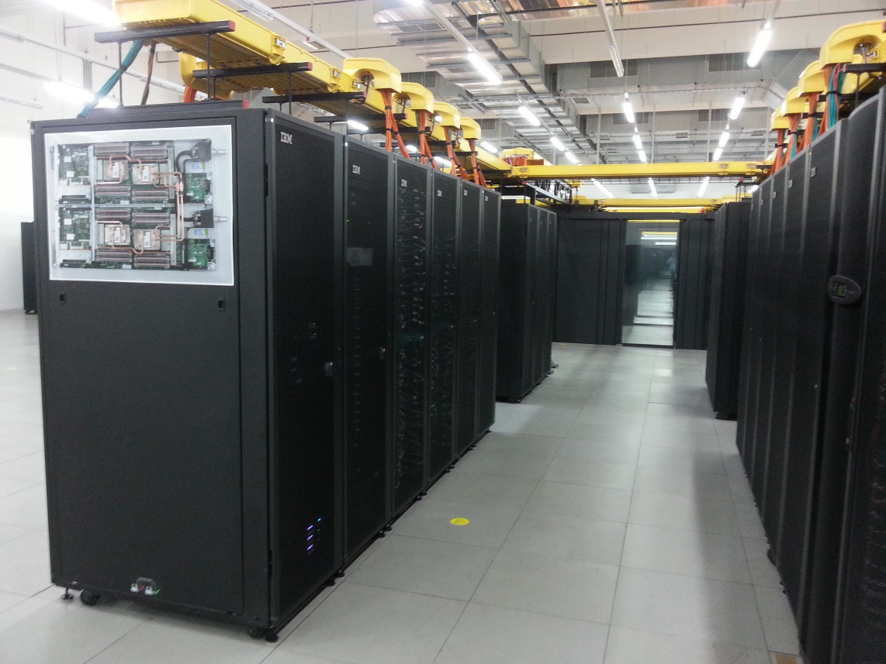

# Processing system

This chapter describes the system developed to meet the requirements analysed in the
previous chapter.

## Production workflow
The following diagram describes the overall workflow for the development and 
production of CCI Sea State Datasets. The processing steps in light blue are 
purely computational steps whereas the steps in dark blue also require expertise 
and interaction among the partners.



The different steps of this workflow are detailed in the following subsections:

### L1 to L2 algorithm selection
Evaluation and selection round of the best algorithm for sea state 
parameter retrieval from altimeter (e.g. retracker) or SAR. The different
algorithms are evaluated over a selection of tracks with respect to the 
statistical and spectral properties of the data and comparisons with model 
and in situ data.

The methodology and results are described in the Product Validation and 
Algorithm Selection Report (PVASR) and/or in a Round-Robin Final Report when 
such competitive assessment was performed (like in CCI Sea State phase 1)

### Integration 
Integration step consists in implementing the selected algorithm onto the 
appropriate processing platform. This includes the following tasks:
- code modification and testing for portability on targeted  processing 
  platform(s)
- putting the code under source control management (gitlab)
- building conda environments or docker images for easy integration and 
  deployment, and keeping the processing context of each dataset version

### L1 to L2 processing
Massively distributed reprocessing of the altimeter or SAR Level 1 data archive 
to produce a complete time series of Sea State parameters using the selected 
algorithm(s), as described in the [processing baseline](altimetry/baseline).

This step (and the following computational steps) involves the usage of 
dedicated tools for job array multiprocessing and monitoring of reprocessing 
progress and status.

### 1Hz Averaging 
Averaging of the full resolution altimeter measurements to 1 Hz values.

### Adding ancillary 
data colocation and addition of complementary fields including:
- SGDR/GDR variables (wind speed, radiometer water vapour content)
- land mask
- distance to coast
- bathymetry
- sea ice concentration
- sea level
- weather model fields (wind speed, pressure, air temperature)
- wave mode fields (SWH)

### Denoising 
EMD-filter based denoising processing for along-track altimeter data. 
Provides EMD-filtered significant wave height, an adjusted and denoised 
significant wave height estimated by CCI Sea State project and based on 
Quilfen and Chapron, 2021.
[Quilfen Y., Chapron B. (2020). On denoising satellite altimeter
measurements for high-resolution geophysical signal analysis.
Advances in Space Research, 68.
https://doi.org/10.1016/j.asr.2020.01.005]

### In Situ data selection and QC

selection of buoys measuring SWH from Copernicus Marine Service In SItu Thematic 
Assembly Center (INS TAC), applying additional quality control procedures to 
detect:
- wrong positions
- stationary measurements
- low resolution measurements (&gt;=0.5 meter for SWH)

The data are saved into a format compatible with the match-up extraction system.

### Cross-over extraction
cross-overs between altimeter missions, in particular against the successive 
reference mission (jason-2) 
for intercalibration or other pairs for verification.

cross-over extraction system uses Naiad open-source software: 
https://gitlab.ifremer.fr/naiad

### Match-up extraction
match-ups extraction between altimeter L2P products and qualified reference in
situ buoys from Copernicus CMEMS In SItu TAC.
match-up extraction system based on felyx open-source 

### Uncertainties and calibration estimation

estimation of the cross-mission inter-calibration from cross-overs/match-ups 
and of the SWH uncertainties from match-ups. This step requires expertise 
and manual analysis, and is performed by a group of experts from the team. 
It produces look-up tables and calibration formulation.

### Adding uncertainties and calibration

implementation of the look-up tables and parametrization for the calculation of 
the uncertainties and SWH adjustment (cross-calibration), applied to each 
measurement from the L2P data.

### L2 to L3 processing 
Concatenation of along-track L2P into a single multi-mission daily files 
containing all the valid (quality = good) SWH measurements and selection of 
variables from the source L2P. 

### L2 to L4 processing
Production of monthly multi-mission statistics of SWH on a 1°x1° grid from 
the L2P.

### Validation 
Expert (manual) activity on the assessment and validation of the produced 
dataset before release.

The methodology is described in the Product Validation Plan (PVP) and the 
results in the Product Validation and Intercomparison Report (PVIR).

### Distribution 
Push of the produced datasets to Ifremer distribution server (HTTPS and FTP) 
and to the ESA CCI central repository.

## Processing toolboxes
The following figure shows the software layers used in CCI SeaState datasets processing,
covering the different processing functions:
- accessing and reading the source data
- processing the altimeter and SAR data from L1 to L2
- adding the ancillary fields
- post-processing to L2P, L3 and L4 level (and adding quality, error and 
  uncertainty information)
- producing cross-overs and match-ups for validation and estimation of the 
  errors and uncertainties
- estimating the error and uncertainties
- running the different processing steps in parallel

The different packages used in each layer are referenced in 
{numref}`processing_packages`, with the corresponding source control 
repositories: 

```{table} Processing packages for the different CCI Sea State datasets
:name: processing_packages

| package     | source control repository                                     | description                                                                                                         |
|-------------|---------------------------------------------------------------|---------------------------------------------------------------------------------------------------------------------|
| cerbere     | https://gitlab.ifremer.fr/cerbere/cerbere                     | a python unified data access API to read L1 and ancillary products in various formats                               |
| ceraux      | https://gitlab.ifremer.fr/cerbere/ceraux                      | a python package to colocate with ancillary data such as sea-ice masks, bathymetry, land mask and distance to coast |
| naiad       | https://gitlab.ifremer.fr/naiad/                              | a python framework to extract cross-overs between different satellite missions                                      |
| felyx       | https://gitlab.ifremer.fr/felyx/                              | a python framework to extract match-ups between satellite and in situ data                                          |
| whales      | https://gitlab.ifremer.fr/cciseastate/whales                  | the selected retracker for LRM altimetry missions, written in python                                                |                                              |
| ceremd      | https://gitlab.ifremer.fr/cerbere/ceremd                      | a python package to denoise data using EMD filter                                                                   |
| DLR         | https://gitlab.com/dlr-earth-observation-center/cci-sea-state | a processor to produce the Sentinel-1 SAR ISSP L2P                                                                  |
| cciseastate | https://gitlab.ifremer.fr/cciseastate/cciseastate             | the python post processing layer to generate full L2P, L3 and L4 products                                           |
| prun        | internal tool                                                 | a python tool to run distributed jobs on a HPC cluster in job array - used for parallel reprocessing.               |
```

## Source code control
The processing software used for CCI Sea State production is versioned under source
control on gitlab or github, and openly accessible whenever it is possible. When restrictions
apply, they are mentioned in above table.

## Processing platforms
The processing of CCI Sea State Dataset is distributed over multiple platforms, depending
on the availability of the input data or how easy it is to migrate the processing software,
though most of the processing was completed on Ifremer / Datarmor infrastructure. The used
platform for each dataset is detailed in {numref}`processing_location`:

```{table} Processing location of the different CCI Sea State datasets
:name: processing_location

| CCI Sea State product | Production Platform | Processing step | Motivation                    |
| --------------------- | ------------------- | --------------- |-------------------------------|
| SAR L2P S1A&B         | DLR / LRZ           | L1 to L2 for ISSW product | Location of IW/EW archive     |
| Altimeter L2P         | Ifremer / Datarmor  | All processing  | Location of altimeter archive |
| Altimeter L3          | Ifremer / Datarmor  | All processing  |                               |
| Altimeter L4          | Ifremer / Datarmor  | All processing  |                               |
```

### Ifremer *Datarmor* platform

Physically, the CCI production platform is mainly based on the Datarmor platform
operated by Ifremer IT department (refer to the facility section in the
management proposal), though a few reprocessing tasks were delegated to other 
platforms (see {numref}`processing_location`).

The current storage capability is about 20 PB and the available capacity largely
exceeds the need for CCI products.

The reprocessing framework for CCI therefore makes use of direct access to the complete
CCI input data archive on disk, physically located within the cluster, and distribution of the
processing over multiple nodes of the cluster. The task of managing and distributing the
processing jobs is alleviated by the use of batch tools implemented by CERSAT (and used
for all its reprocessing works) such as prun.
Prun is a tool which aims to ease the execution and monitoring of embarrassingly parallel
processings. It is a wrapper which submits jobarrays to batch schedulers (torque/maui, oar,
pbspro...) and manages the output logs and progress reports, with an easy monitoring.
Jobarray submission to batch schedulers is generally easy, but monitoring the job progress
and accessing to the error logs of a few tasks among thousands is the same as finding a
needle in a haystack... This wrapper was created to avoid spending more time in manual
“logfile-mining” (grep, tail...) than the processing time itself. Some other needs it addresses:
- listing management avoids too big jobarrays (which crashes some batch schedulers)
- list the tasks in errors to ease their reprocessing
- allowing several execution modes : sequential, streaming (pipe)
- allowing multiple batch scheduler as backend
- having tasks status reporting and real-time monitoring
- having job history, meta-data &amp; log files organization

The Ifremer supercomputer, Datarmor, provides scalable capabilities for:
- CPU intensive or memory demanding applications and processing
- massive data storage

It consists of:
- 11088 cores - 426 Tflops (128 GB memory and 28 cores per node) for HPC
applications
- 240 cores, 5 TB RAM for non MPI processing
- 10 servers for web services
- large data storage capacity
  - 500 TB Lustre for HPC
  - 1.5 PB Luster storage for reference data
  - 5 PB GPFS storage for project and work data
  - 100 TB for services and web applications
  - 32 TB per home directory
  - 1.5 PB storage is currently reserved for CERSAT processing in this 
    infrastructure which is deemed to be sufficient for the CCI Sea State 
    requirements.



### LRZ HPC Linux Cluster (DLR processing)
DLR uses of the High Performance Computing (HPC) Linux Cluster of 
Leibniz Supercomputing Centre (LRZ). Usage of the LRZ HPC Linux Cluster is 
enabled by framework contract between DLR and LRZ.



Detailed information about the LRZ HPC Linux Cluster can be found here:
https://doku.lrz.de/linux-cluster-10745672.html 


## Product distribution
The CCI Sea State Datasets are available on three different servers for different stages of
the dataset life cycle, as described here:

### Partner access
Shared access for project partners before public release for assessment and 
validation.

```{table}
| | |
| ---- | ---- |
| **FTP URL** | ftp://eftp.ifremer.fr |
| **login** | e0321bf |
| **password** | incitent-professerait-culbutees |
```

### User Preliminary Access
Preliminary access to data for early releases and updates before they are 
integrated into CCI Portal.

```{table}
| | |
| ---- | ---- |
| **FTP URL** | ftp://eftp.ifremer.fr |
| **login** | pe31b4c |
| **password** | yellowsubrolling |
```

### CCI Portal Access:
Permanent public user access.

https://climate.esa.int/en/projects/sea-state/data/

Specific DOIs are associated to each dataset version and product level by 
the CCI Data Portal’s Technical Team (e.. for CCI Sea State Dataset version 
2, specific DOIs are minted  independently for L2P, L3 and L4 products).

The data organization follows the recommendation of CCI Data Standards 
version 2.0 and are described in the Product Specification Document.

